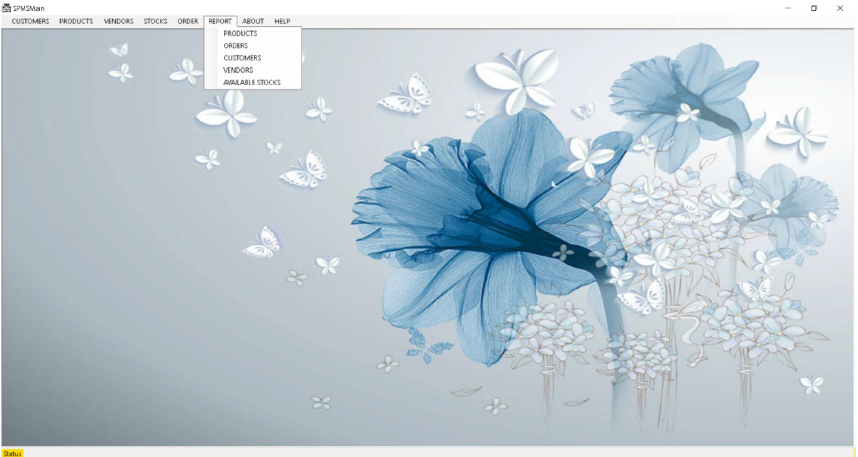
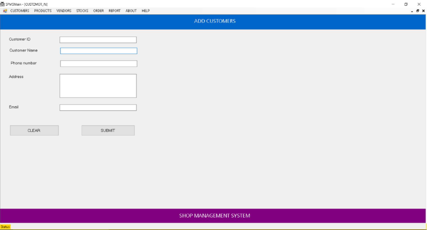
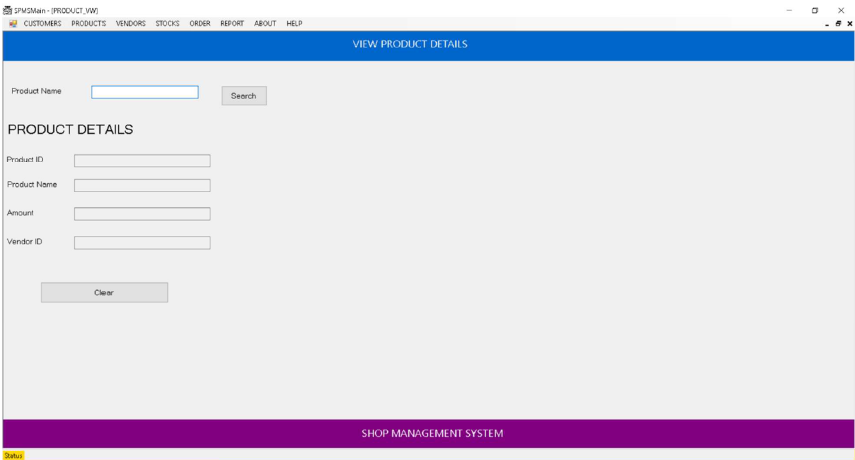
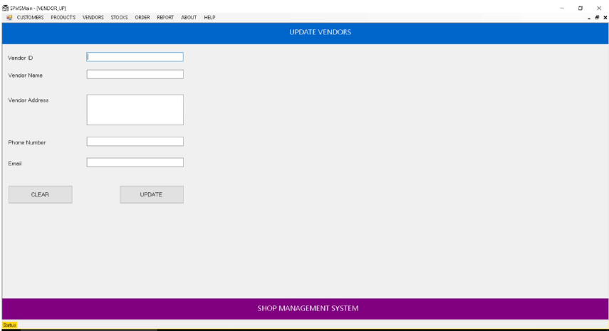
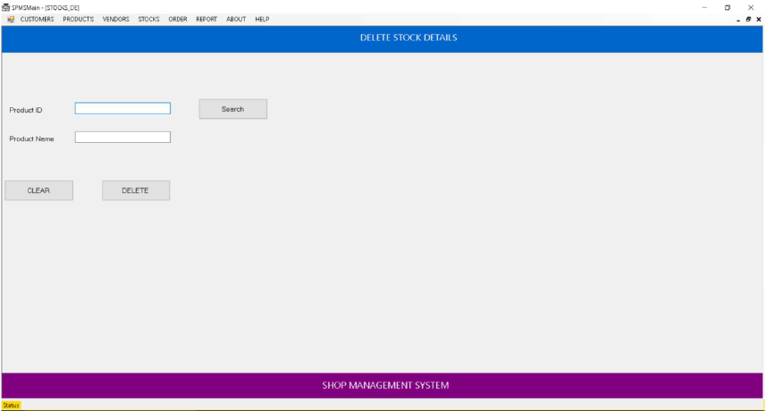
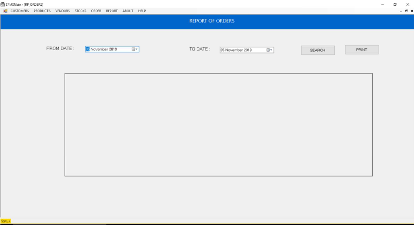

# Shop Management System.

Shop Management is developed to manage the small shops.
Our product is a comprehensive software solution that simplifies day to day operations and increases performance efficiency. Designed to increase business efficiency for its users. It delivers a fully integrated approach to shop management with all its business operations built in a single and comprehensive solutions. This software is not particularly built for a kind of shop and it is developed to be general. There is only one user that is admin. 

### Features and functionalities
****
  - Order Management
  - Stock Management
  - Access Management
  - Report Management
  - Vendor Management
  - Product Management
  - Customer Management

### Database Used
****
A  Relational database is a collection of interrelated data stored with minimum redundancy to serve many users quickly and effectively. After designing input and output, the analyst must concentrate on database design or how data should be organized around user requirements. The general objective is to make information access, easy quick, inexpensive and flexible for user. 
 
 - We have used Microsoft Sql server 2014 database for developing the database.
- We manage the database using Microsoft database management system. 
- We have made use of *Shop Management System(SPMS)* database which contains relations customer,   Product, Vendor, Order, Stock that helps us to manage data as we need and use it.

### Technologies:-
****
Shop Management System uses following:

* [C#](https://docs.microsoft.com/en-us/dotnet/csharp/)
* [Windows Forms](https://docs.microsoft.com/en-us/dotnet/framework/winforms/) 
* [ADO.Net](https://docs.microsoft.com/en-us/dotnet/framework/data/adonet/) 
* [Microsoft SQL Server](https://www.microsoft.com/en-in/sql-server/sql-server-2019)
* [Visual Studio 2017](https://visualstudio.microsoft.com/)

### Installation
****
Install the following softwares.
* [Visual Studio](https://visualstudio.microsoft.com/vs/older-downloads/)
* [Microsoft SQL Server](https://www.microsoft.com/en-in/sql-server/sql-server-downloads). 

### Follow the following steps
****

1) Run the SQL commands for creating of tables, Views, Stored Procedures. SQL Commands are available in SQL file.

2) Run the database and connect it to the visual Studio.

3) Get the connection String from the visual studio and enter it in the Connect.cs class.

4) Check if any errors are there for library or dependencies.

5) Run the application.

### Application user Interface
****
- Login
***

***
- Home
***

****
- Customer
***

****
- Product
***

****
- Vendor
***

****
- Stock
***

****
- Order
***

****
- Report
***

                                                  
### References
****
 [Windows Forms](https://docs.microsoft.com/en-us/dotnet/framework/winforms/)
 [ADO.Net](https://docs.microsoft.com/en-us/dotnet/framework/data/adonet/)
 [Microsoft SQL Server](https://www.microsoft.com/en-in/sql-server/sql-server-2019)
 [How to get Connection String?](https://www.youtube.com/watch?v=1U0cP2rvr2g)
 [SQL Basics](https://www.sqlservertutorial.net/sql-server-basics/)

Thank You...
